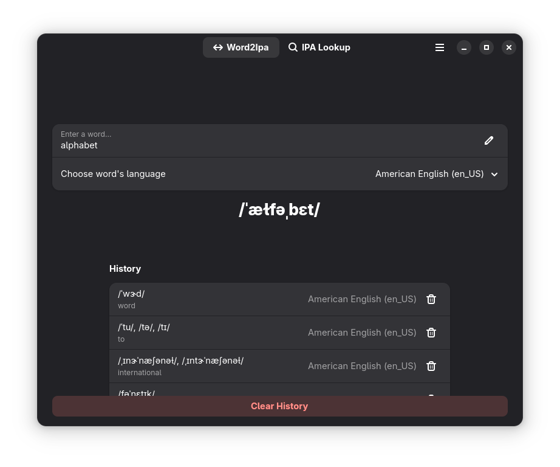
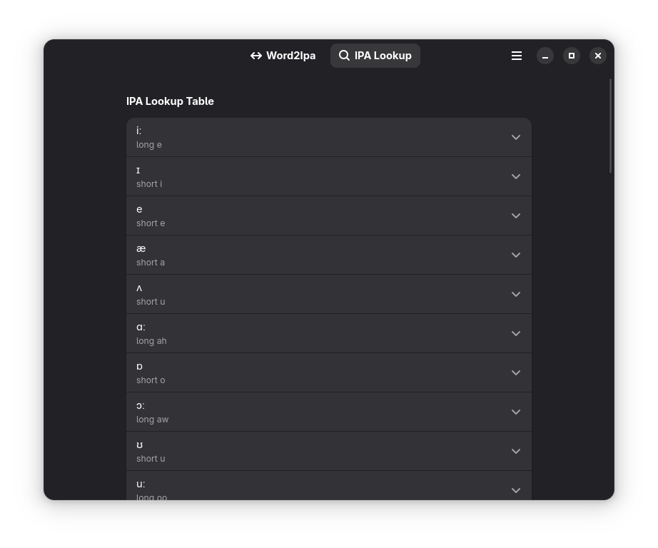

  

<h1 align="center">Phoneme</h1>

<em>Turn words into their true sounds.</em>

  Spelling doesn't always reflect pronunciation—especially across different dialects or languages.
  If you're learning English or teaching phonetics, you need a tool that shows how words are really spoken.

  <strong>Phoneme</strong> converts English (and other languages) words into the International Phonetic Alphabet (IPA),
  providing a clear and standardized representation of pronunciation.

---

Phoneme lets you look up individual words or paste entire phrases and see how they are pronounced in the IPA format. It's a perfect tool for language learners, linguists, or speech technology developers.

> [!IMPORTANT]
> The [GNOME Code of Conduct](https://conduct.gnome.org) applies to this project, including this repository.

## Features
- 🗣 Convert English text into IPA pronunciation
- 💾 copy the transcription to clipboard
- 📙 Built-in IPA symbol dictionary to help you understand each phonetic symbol

## Screenshots

  
  

## How 2 Build
### GNOME Builder
1. Install Builder from [Flathub](https://flathub.org/apps/org.gnome.Builder).
2. Click the **Clone Repository** button at the bottom right and enter the repository URL.
3. Once cloned, locate the dropdown menu next to the `io.github.mohfy.phoneme.json` text at the top of the screen.
4. Use the dropdown to press **Build** to compile the project. From the same menu, you can also **Run** the project or **Export** it as a Flatpak bundle.

## Credits
* **IPA Dictionary Data:** Provided by [ipa-dict](https://github.com/open-dict-data/ipa-dict).
* **Application Icon:** Designed by @Blisterexe.

